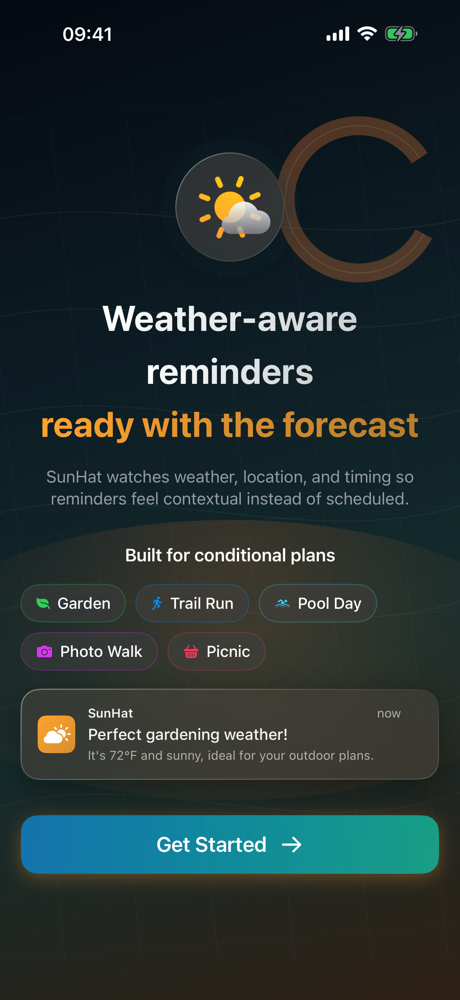
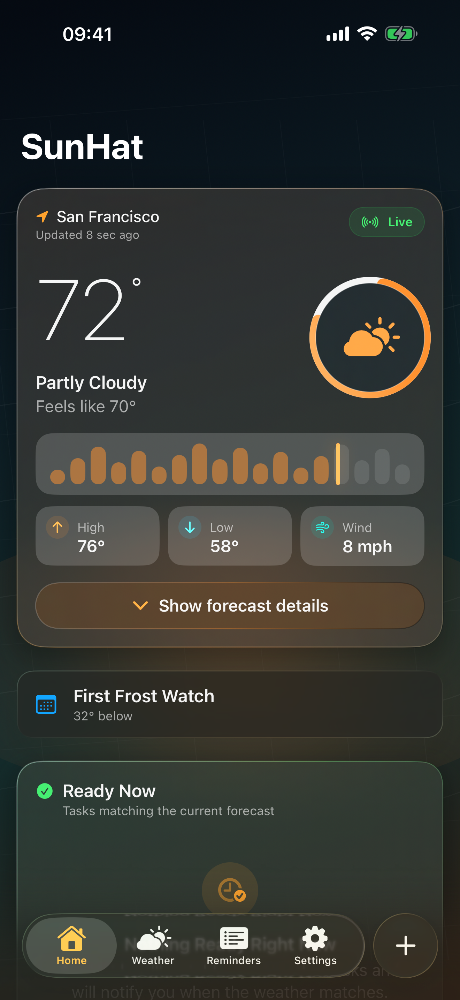
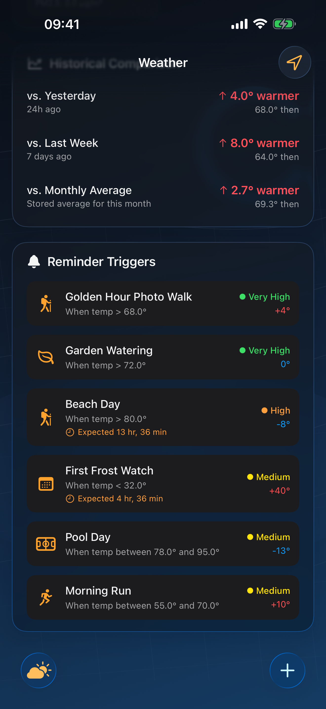
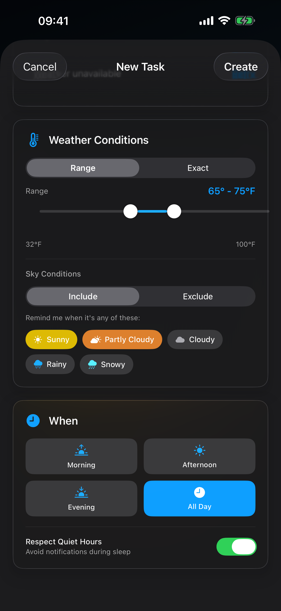
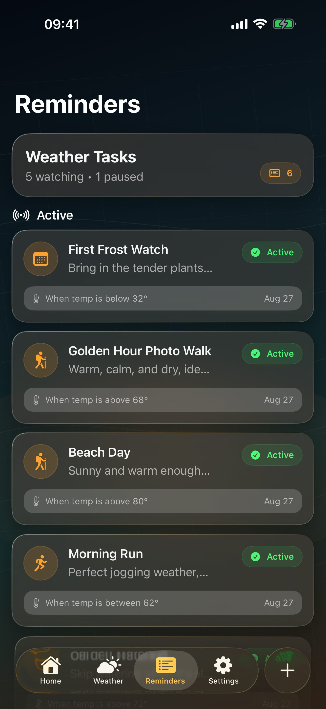
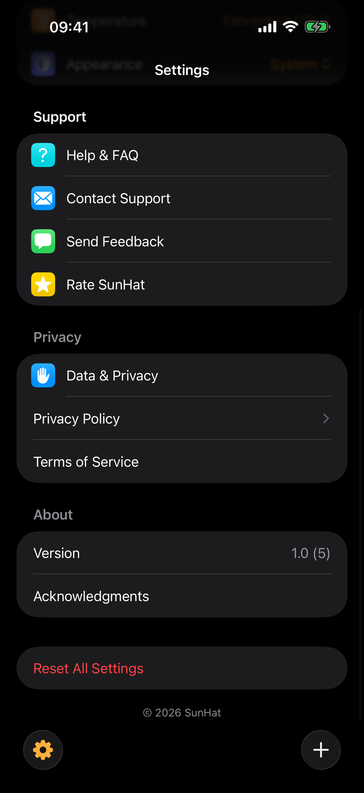

<h1 align="center">SunHat</h1>

<p align="center">
  <strong>Reminders that wait for the right weather.</strong>
</p>

<p align="center">
  <a href="https://github.com/keetchcode/sunhat/actions/workflows/ios-build.yml"></a>
  
  
  
  <a href="LICENSE"></a>
</p>

<p align="center">
  Most reminder apps ask <em>when</em>. SunHat asks <em>what conditions</em>.<br/>
  Set "water the garden when it's been dry for 48 hours" or<br/>
  "golden hour photo walk when it's above 68F and clear," and SunHat<br/>
  watches the forecast and tells you when reality matches your intent.
</p>

<p align="center">
  Built for iOS with SwiftUI, SwiftData, and WeatherKit.<br/>
  No accounts. No tracking. No third-party dependencies.
</p>

---

## What SunHat actually does

A calendar reminder for "go for a run" fires whether it's sunny or sleeting. SunHat's whole idea is that some plans are conditional, not scheduled, and your phone already knows the weather.

You describe the conditions you want. SunHat watches the forecast in the background. You get a notification when they're met. That's the whole app, and everything in the codebase serves that loop.

**Example reminders:**
- "Go for a run when it's 55-70F and clear"
- "Water the garden when it's been dry for 48 hours"
- "Beach day when it's above 80F with no rain in the forecast"
- "Golden hour photo walk when it's above 68F and sunny"

## Features

| Feature | Details |
|---------|---------|
| **7 trigger types** | Exact temperature, temperature range, sky conditions, feels-like, dry period, consecutive days, and composite (temp + humidity + wind) |
| **Smart predictions** | Forecast-based confidence scoring so you know when conditions are likely to be met |
| **Background monitoring** | iOS BackgroundTasks framework checks weather and notifies you when conditions align |
| **Hourly forecast** | Real WeatherKit hourly data on the dashboard, not synthesized |
| **Temperature history** | Trend charts with yesterday, last week, and monthly averages |
| **Quiet hours & limits** | Control when and how often you get notified |
| **Manual city selection** | Use GPS or pick any city yourself |
| **App Intents & Shortcuts** | Create reminders from Siri and Shortcuts |
| **Spotlight indexing** | Find reminders from iOS search |
| **Data export & deletion** | Full GDPR compliance, tested with schema-parity tests |
| **Liquid Glass UI** | Native iOS 26 design language with `.glassEffect()` surfaces |
| **Zero tracking** | No accounts, no analytics, no third-party SDKs |

## Screenshots

Captured on iOS 26 (iPhone). SunHat is iPhone-first; iPad, widget, and watch surfaces are planned (see [Project status](#project-status)).

| | | |
|---|---|---|
|  |  |  |
|  |  |  |

## Requirements

| | |
|---|---|
| Xcode | 26+ |
| Swift | 6.2 |
| Minimum iOS | 26.0 |
| Dependencies | None. Apple frameworks only. |

No CocoaPods, no SPM packages, no Carthage. Every import is an Apple framework. This is intentional and non-negotiable.

## Getting started

```bash
git clone https://github.com/keetchcode/sunhat.git
cd sunhat
open SunHat.xcodeproj
```

Build and run with Cmd+R. Tests are Cmd+U.

From the command line:

```bash
xcodebuild -scheme SunHat -configuration Debug -destination 'generic/platform=iOS Simulator' build
```

```bash
xcodebuild -scheme SunHat -destination 'platform=iOS Simulator,name=iPhone 17 Pro' -only-testing:SunHatTests test
```

### WeatherKit setup

Live weather requires a WeatherKit entitlement tied to your own Apple Developer team:

1. Enable the **WeatherKit** capability for your App ID in the Apple Developer portal.
2. Change `PRODUCT_BUNDLE_IDENTIFIER` to something you own (it ships as `org.wesley.sunhat`).
3. Regenerate your provisioning profile *after* adding the capability. A profile created before it will fail at runtime.

Without it the app builds and runs, but weather fetches fail. Failures log the raw provider error under subsystem `org.wesley.sunhat`, category `AppleWeatherKitAPI` (visible in Console.app).

## Architecture

MVVM over SwiftData, with protocol seams for anything that touches the outside world.

```
SunHat/
  Models/          SwiftData @Model types (WeatherReminder, TriggerCondition, WeatherData)
  ViewModels/      Presentation state. @Observable for new code, ObservableObject where Combine remains
  Views/           SwiftUI, grouped by feature (Dashboard, Weather, Reminders, Settings, Onboarding)
  Services/
    Weather/       WeatherKit provider + caching behind WeatherProviding
    Trigger/       Condition evaluation engine (the core logic)
    Location/      CoreLocation wrapper behind LocationManaging
    Notifications/ Deep-link handoff, data clearing, category registry
  Utilities/       Theme, motion, formatting helpers
```

**The trigger engine is the heart of the app.** `TriggerEngine+ForecastAnalysis.swift` evaluates whether current or forecast conditions satisfy a reminder's `TriggerCondition`. It's the most correctness-sensitive code in the project and has the densest test coverage. Changes there need tests.

**Dependency-injection seams** (`WeatherProviding`, `LocationManaging`, `SettingsOpening`, `NotificationPermissionProviding`) exist so view models can be tested without hitting the network, GPS, or the system. Use them. Don't reach for singletons in new code.

### Design language

iOS 26 Liquid Glass. Card surfaces use `.glassEffect()`. Page backgrounds use `Color(.systemBackground)`. Avoid `.regularMaterial` (superseded) and avoid nesting glass inside glass. Respect `accessibilityReduceMotion` for anything animated.

## Testing

Unit tests live in `SunHatTests/` (Swift Testing for new suites, XCTest for older ones). UI tests in `SunHatUITests/` are XCTest-only.

`ScreenshotCaptureUITests` drives real interactive flows and doubles as App Store screenshot generation.

**Simulator note:** The app's location permission affects test outcomes. `notDetermined` triggers a system permission dialog the UI tests don't dismiss. `denied` fails dashboard tests that assert a clean initial state. Keep it granted:

```bash
xcrun simctl privacy <device-udid> grant location org.wesley.sunhat
```

## Project status

Version 1.0, iPhone-first, preparing for App Store submission.

**Working:** Weather-triggered reminders across 7 trigger types, background monitoring, notifications, App Intents/Shortcuts, Spotlight indexing, data export and deletion, notification deep-linking, complete privacy deletion.

**Tested:** 258+ unit tests across 50+ suites covering trigger engine correctness, weather service cancellation, privacy deletion parity, notification delivery, and location persistence.

**Planned:** WidgetKit and Lock Screen widgets, watchOS complication, iPad-optimized layout, CloudKit sync (prepared in code, needs provisioning), String Catalog localization (all copy is currently inline English).

### Toolchain note

The project targets Xcode 26 / Swift 6.2, but currently builds against the Xcode 27 beta, which is stricter about actor isolation for protocol conformances and introduced a `LinearGradient` `.opacity` ambiguity. Both are handled in-tree with explanatory comments. If you're on the released Xcode, the code still compiles.

CI runs on `macos-latest` via GitHub Actions. The build-for-testing step uses the `SunHatUnitTests` scheme.

## Principles

These are the constraints the code is held to. They're worth reading before contributing.

1. **Never invent weather data.** If the provider has no hourly forecast, the UI says so. It does not synthesize plausible-looking numbers. Historical comparisons show "Not enough history yet" rather than a placeholder. This rule has teeth: several past changes were reverted for breaking it, and there are regression tests guarding it.

2. **Never imply official authority.** SunHat's threshold notices are branded "SunHat Advisory" with the exact threshold disclosed. They are not government or WeatherKit severe-weather alerts and must never look like them.

3. **Privacy is a feature, not a page.** Location stays on-device. Coordinates go only to the weather provider, only to fetch a forecast. "Delete all my data" must actually delete everything, including state stored outside SwiftData.

4. **Controls must do what they say.** A toggle that doesn't persist, or a screen that doesn't work, gets deleted rather than shipped.

## Contributing

See [CONTRIBUTING.md](CONTRIBUTING.md). The short version: keep the weather-trigger loop central, never fabricate data, add tests for trigger-engine and view-model logic, and match the surrounding code's style.

## License

MIT. See [LICENSE](LICENSE).

---

<p align="center">
  <sub>Built with SwiftUI, SwiftData, and WeatherKit.</sub>
</p>
