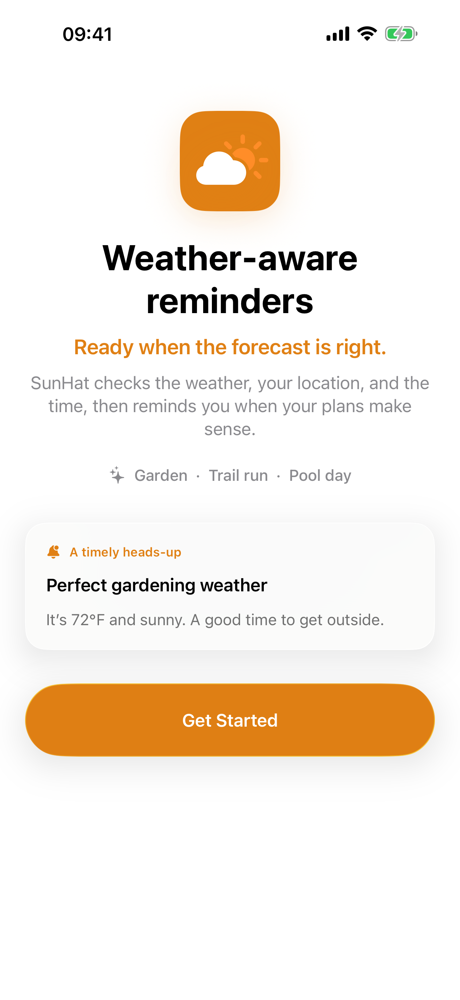
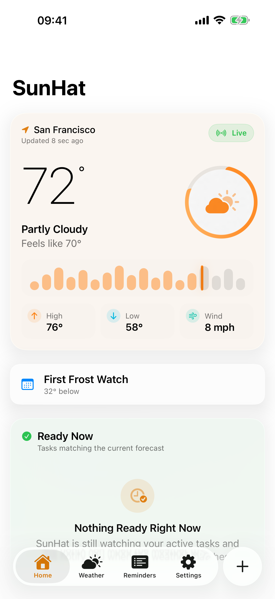
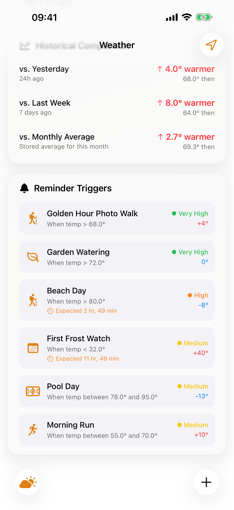
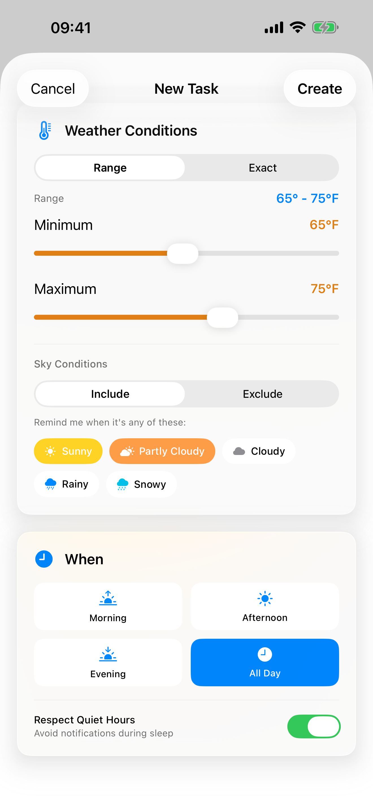
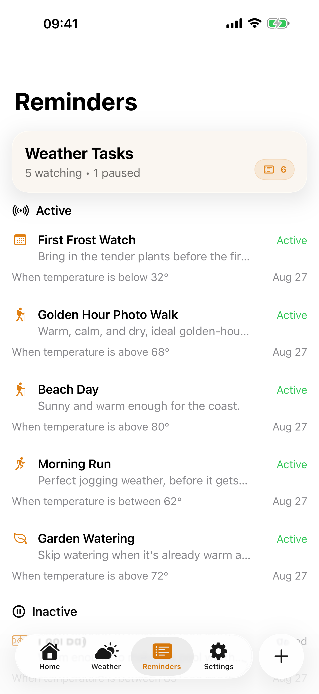
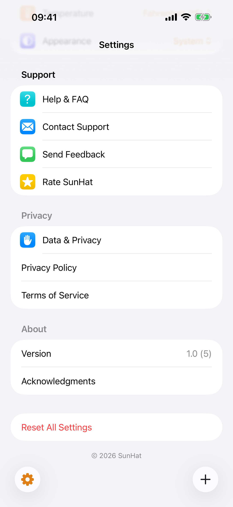

<h1 align="center">SunHat</h1>

<p align="center">
  <strong>Reminders that wait for the right weather.</strong>
</p>

<p align="center">
  <a href="https://github.com/weskcode/sunhat/actions/workflows/ios-build.yml"></a>
  
  
  <a href="LICENSE"></a>
</p>

<p align="center">
  Most reminder apps ask <em>when</em>. SunHat asks <em>what conditions</em>.<br/>
  Set "water the garden when it's been dry for 48 hours" or<br/>
  "golden hour photo walk when it's above 68F and clear," and SunHat<br/>
  watches the forecast and tells you when reality matches your intent.
</p>

<p align="center">
  Built for iOS with SwiftUI, SwiftData, and WeatherKit.<br/>
  No accounts. No tracking. No third-party dependencies.
</p>

---

## What SunHat does

A normal calendar reminder for "go for a run" goes off whether it's sunny or sleeting. SunHat takes a different approach: some plans depend on the weather, not the clock.

You describe the conditions you care about. SunHat checks the forecast in the background and sends a notification when those conditions show up. That's the whole idea, and everything in the app supports that one loop.

**A few things you can set up:**
- "Go for a run when it's 55-70F and clear"
- "Water the garden when it's been dry for 48 hours"
- "Beach day when it's above 80F with no rain in the forecast"
- "Golden hour photo walk when it's above 68F and sunny"

## Features

| Feature | Details |
|---------|---------|
| **7 trigger types** | Exact temperature, temperature range, sky conditions, feels-like, dry period, consecutive days, and composite (temp + humidity + wind) |
| **Smart predictions** | Forecast-based confidence scoring so you know when conditions are likely to be met |
| **Background monitoring** | iOS BackgroundTasks checks the weather and notifies you when conditions line up |
| **Hourly forecast** | Real WeatherKit hourly data on the dashboard, not made-up numbers |
| **Temperature history** | Trend charts with yesterday, last week, and monthly averages |
| **Quiet hours and limits** | Control when and how often you get notified |
| **Manual city selection** | Use GPS or pick any city yourself |
| **App Intents and Shortcuts** | Create reminders from Siri and Shortcuts |
| **Spotlight indexing** | Find reminders from iOS search |
| **Data export and deletion** | Full GDPR-style export and deletion, covered by schema-parity tests |
| **Liquid Glass UI** | Native iOS 26 design with `.glassEffect()` surfaces |
| **Zero tracking** | No accounts, no analytics, no third-party SDKs |

## Screenshots

Captured on iOS 26 (iPhone). SunHat is iPhone-first. iPad, widget, and watch surfaces are planned (see [Project status](#project-status)).

**Dark**

| | | |
|---|---|---|
|  |  |  |
|  |  |  |

**Light**

| | | |
|---|---|---|
|  |  |  |
|  |  |  |

## Requirements

| | |
|---|---|
| Xcode | 26+ |
| Swift | 6.2 |
| Minimum iOS | 26.0 |
| Dependencies | None. Apple frameworks only. |

No CocoaPods, no SPM packages, no Carthage. Every import is an Apple framework, and that's intentional.

## Getting started

```bash
git clone https://github.com/weskcode/sunhat.git
cd sunhat
open SunHat.xcodeproj
```

Build and run with Cmd+R. Run the tests with Cmd+U. From the command line:

```bash
xcodebuild -scheme SunHat -configuration Debug -destination 'generic/platform=iOS Simulator' build
```

```bash
xcodebuild -scheme SunHat -destination 'platform=iOS Simulator,name=iPhone 17 Pro' -only-testing:SunHatTests test
```

### WeatherKit setup

Live weather needs a WeatherKit entitlement tied to your own Apple Developer team:

1. Turn on the **WeatherKit** capability for your App ID in the Apple Developer portal.
2. Change `PRODUCT_BUNDLE_IDENTIFIER` to something you own (it ships as `org.wesley.sunhat`).
3. Regenerate your provisioning profile after adding the capability. A profile created before the capability was added will fail at runtime.

Without it the app builds and runs, but weather fetches fail. Failures log the raw provider error under subsystem `org.wesley.sunhat`, category `AppleWeatherKitAPI` (visible in Console.app).

## Architecture

MVVM on top of SwiftData, with protocol seams for anything that touches the outside world.

```
SunHat/
  Models/          SwiftData @Model types (WeatherReminder, TriggerCondition, WeatherData)
  ViewModels/      Presentation state. @Observable for new code, ObservableObject where Combine remains
  Views/           SwiftUI, grouped by feature (Dashboard, Weather, Reminders, Settings, Onboarding)
  Services/
    Weather/       WeatherKit provider and caching behind WeatherProviding
    Trigger/       Condition evaluation engine (the core logic)
    Location/      CoreLocation wrapper behind LocationManaging
    Notifications/ Deep-link handoff, data clearing, category registry
  Utilities/       Theme, motion, formatting helpers
```

The trigger engine is the heart of the app. `TriggerEngine+ForecastAnalysis.swift` decides whether current or forecast conditions satisfy a reminder's `TriggerCondition`. It's the most correctness-sensitive code in the project, so it has the densest test coverage. Changes there need tests.

Dependency-injection seams (`WeatherProviding`, `LocationManaging`, `SettingsOpening`, `NotificationPermissionProviding`) let view models be tested without touching the network, GPS, or system APIs. Use them instead of singletons in new code.

### Design language

iOS 26 Liquid Glass. Card surfaces use `.glassEffect()`. Page backgrounds use `Color(.systemBackground)`. Don't use `.regularMaterial` (it's superseded) and don't nest glass inside glass. Respect `accessibilityReduceMotion` for anything animated.

## Testing

Unit tests live in `SunHatTests/` (Swift Testing for newer suites, XCTest for older ones). UI tests in `SunHatUITests/` are XCTest.

The app's location permission affects UI test results. `notDetermined` triggers a system permission dialog the tests don't dismiss, and `denied` fails dashboard tests that expect a clean initial state. Keep it granted:

```bash
xcrun simctl privacy <device-udid> grant location org.wesley.sunhat
```

## Project status

Version 1.0, iPhone-first, preparing for App Store submission.

**Working:** Weather-triggered reminders across 7 trigger types, background monitoring, notifications, App Intents and Shortcuts, Spotlight indexing, data export and deletion, notification deep-linking, and complete privacy deletion.

**Tested:** A unit test suite covers the trigger engine, weather service, privacy deletion parity, notification delivery, and location persistence.

**Planned:** WidgetKit and Lock Screen widgets, a watchOS complication, an iPad-optimized layout, CloudKit sync (already prepared in code, needs provisioning), and a String Catalog for localization (all copy is currently inline English).

### Toolchain note

The project targets Xcode 26 and Swift 6.2, but it currently builds against the Xcode 27 beta, which is stricter about actor isolation for protocol conformances and introduced a `LinearGradient` `.opacity` ambiguity. Both are handled in-tree with comments. If you're on the released Xcode, the code still compiles.

CI runs on `macos-latest` via GitHub Actions. The build-for-testing step uses the `SunHatUnitTests` scheme.

## Principles

These are the rules the code is held to. Read them before contributing.

1. **Never invent weather data.** If a provider returns no hourly forecast, the UI says so. It does not fill in plausible-looking numbers. Historical comparisons show "Not enough history yet" instead of a placeholder. This rule has caught real regressions, and there are tests guarding it.
2. **Never imply official authority.** Threshold notices are branded "SunHat Advisory" and show the exact threshold. They are not government or WeatherKit severe-weather alerts and must never look like them.
3. **Privacy is a feature, not a page.** Location stays on-device. Coordinates go only to the weather provider, and only to fetch a forecast. "Delete all my data" must actually delete everything, including state stored outside SwiftData.
4. **Controls must do what they say.** A toggle that doesn't persist, or a screen that doesn't work, gets deleted rather than shipped.

## Contributing

See [CONTRIBUTING.md](CONTRIBUTING.md). The short version: keep the weather-trigger loop central, never fabricate data, add tests for trigger-engine and view-model logic, and match the surrounding code's style.

## License

MIT. See [LICENSE](LICENSE).

---

<p align="center">
  <sub>Built with SwiftUI, SwiftData, and WeatherKit.</sub>
</p>
